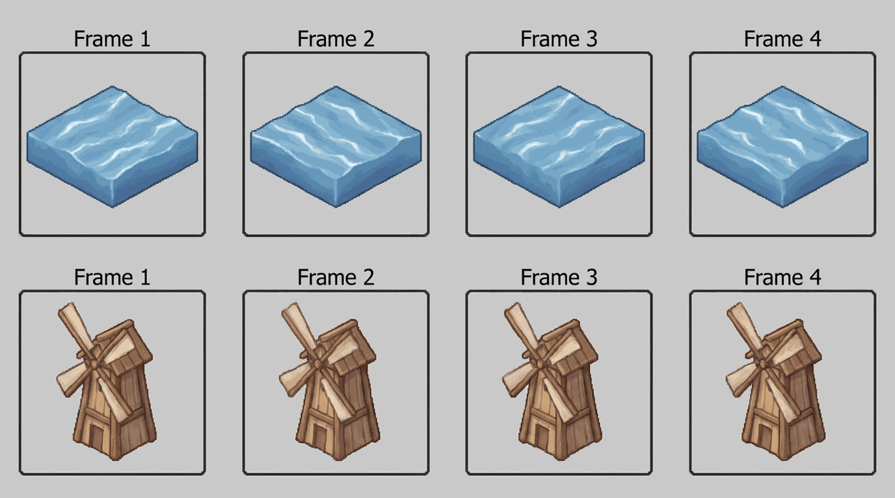

# Animated Sprite Generation



## Overview

Animation in 2D isometric games is frame-based, not skeletal. This skill produces short, seamless LOOPS as frame strips. Do NOT animate ground tiles - animate objects on top of them, or performance and visual noise explode.

## When to Use

- You need animated water, fire, smoke, windmills, or flags.
- You want idle/ambient motion without a 3D engine.
- A sprite must loop seamlessly without a visible jump.

## Process

1. Decide frame count for a clean loop (4-8 frames is plenty for ambient motion).
2. Generate frames with a FIXED seed, varying only the motion phrase per frame (e.g. wave phase, blade angle).
3. Keep the silhouette and lighting identical - only the moving part changes.
4. Assemble frames into a horizontal strip / sprite sheet.
5. Confirm frame 1 and frame N loop seamlessly (last frame flows into first).
6. Play back in-engine at a low FPS (6-12) for ambient motion.
7. NEVER animate full ground tiles - animate overlay objects only.

```bash
# assemble frames into a horizontal strip
convert frame_*.png +append spritesheet.png
```

## Rationalizations (Stop Lying to Yourself)

| Excuse | Reality |
|---|---|
| "More frames = smoother = better" | More frames = more VRAM and bigger atlas for zero visible gain on ambient loops. |
| "I will animate the water tiles directly" | Animating every ground tile tanks performance. Use an overlay object. |

## Red Flags - STOP if you catch yourself:

- Animating ground tiles instead of overlay objects.
- Loop visibly jumps between last and first frame.
- Silhouette or light changes between frames.

## Verification

You are NOT done until every box is checked:

- [ ] The loop is seamless (last frame flows into first).
- [ ] Only the intended part moves; silhouette/light stay fixed.
- [ ] Ground tiles are NOT animated; only overlay objects are.
