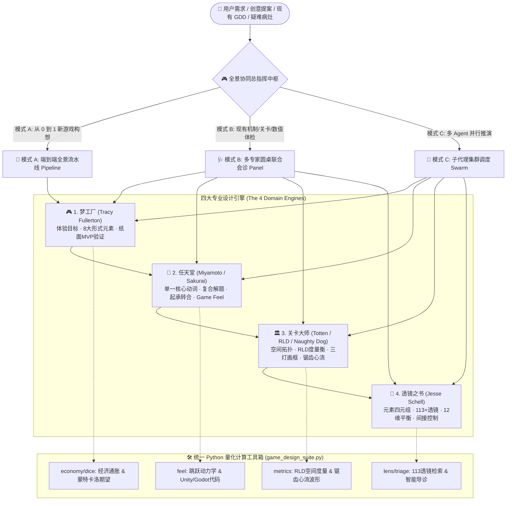
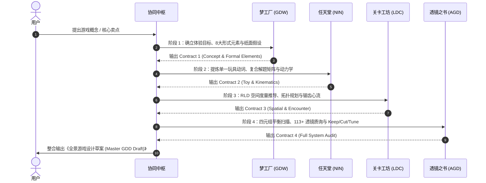

# 游戏设计全景协同中枢与总指挥导师 (Game Design Master Orchestrator) 🎮🌐

本 Skill 是 **Game Design Skills Suite** 的统一总指挥中枢（Game Director & Master Orchestrator）。它将经典游戏设计方法与量化工具融合为一个**版本化契约流转、严格 Schema 校验、可复现计算支持**的设计中枢。

---

## 🧭 全景协同架构与四大引擎矩阵



---

## 📚 知识库参考手册索引

在处理复杂任务或需要深度参考时，按需查阅对应手册：

- [全景协同总线协议与数据契约](references/orchestration-protocol.md): 4 阶段状态转换机、流转规范与版本化数据载荷（Data Payloads）。
- [多 AI Agent 集群调度指南](references/subagent-swarm-guide.md): 4 大子 Agent 角色卡模版、提示词规范与结果仲裁合并流程。
- [生产导向 GDD 草案与体检模版库](references/master-templates.md): 包含《端到端全域 GDD 规范》与《多维外科手术式会诊报告模版》。
- 四大专业子技能手册：
  - [游戏设计梦工厂指南](../game-design-workshop/SKILL.md)
  - [任天堂游戏设计指南](../nintendo-game-design/SKILL.md)
  - [关卡设计大师指南](../level-design-craft/SKILL.md)
  - [透镜之书全景指南](../art-of-game-design/SKILL.md)

---

## 🎯 三大核心实战工作流 (Tri-Mode Master Workflows)

根据用户输入的性质，自动识别并激活以下工作模式之一：

---

### 模式 A：端到端全景流水线 (End-to-End Master Pipeline)

**适用场景**：用户仅有一句话灵感、核心玩法创意或高层设计概念，需要从 0 到 1 形成可进入原型与玩家测试阶段的完整 GDD 草案。



#### 流水线执行四步法：

1. **阶段 1：体验目标与形式元素确立（梦工厂）**
   - 确立核心玩家体验目标（Player Experience Goals）。
   - 定义 8 大形式元素（玩家、目标、规则、资源、冲突、边界、结果、流程）与 4 大戏剧元素。
   - 提取 1 个纸面极速验证假设（Paper Prototype Hypothesis）。
   - *（可选运行工具：`python game_design_suite.py economy` 模拟资源流转）*

2. **阶段 2：核心玩具动词与微观手感（任天堂）**
   - 提炼**单一核心物理动词**（如“磁力抓取”、“重力翻转”、“影子潜行”）。
   - 构建**复合解题矩阵（1个动词同时解决：移动 + 战斗 + 解谜）**。
   - 编排微观教学的**起承转合 4 步法 (Kishōtenketsu)**。
   - 反解角色垂直/水平跳跃动力学参数（土狼时间/输入缓冲/卡肉顿挫）。
   - *（必须运行工具：`python game_design_suite.py feel --height H --apex_time T`）*

3. **阶段 3：空间拓扑与遭遇战锯齿心流（关卡工坊）**
   - 基于手感动力学自动换算 **RLD 度量衡**（掩体高低、门洞宽高、安全跳跃跨度 $D_{\text{safe}}$ 与极限跨度 $D_{\text{max}}$）。
   - 规划关卡空间拓扑（宽线性 Hub、瑞士奶酪垂直回环）。
   - 部署隐性引导（第 2 层：Valve 三灯原则、几何画框构图）。
   - 编排遭遇战 **Sawtooth 锯齿张力波形**（严禁连续 3 个 $\ge 70$ 高压区，强制插入 15~30 秒冷却搜刮区）。
   - *（必须运行工具：`python game_design_suite.py metrics --from-payload ...`）*

4. **阶段 4：四元组平衡与全景透镜质询（透镜之书）**
   - 元素四元组（机制/故事/美学/技术）一致性与全息设计检查。
   - 调动 113+ 透镜特战小队（如【#35 意义选择】、【#31 心流】、【#43 间接控制】、【#37 隐性容错】）深度质询。
   - 输出外科手术式清单：
     - 🟢 **保留 (Keep)**: 机制中最具闪光点的独创设计。
     - 🔴 **裁剪 (Cut)**: 冗余复杂的说明书、破坏沉浸的 UI 或过载机制。
     - 🟡 **调优 (Tune)**: 毫秒级手感参数、数值斜率、关卡间距与冷却波谷。

---

### 模式 B：多专家圆桌联合会诊 (Roundtable Multi-Expert Triage)

**适用场景**：现有游戏或策划案出现具体设计痛点（如“战斗手感生硬无聊”、“玩家疯狂迷路卡关”、“数值恶性通胀”、“无脑复读最优解”）。

四大领域专家同场就诊，各自从专业视角进行穿透式质询并联合会诊：

| 会诊专家 | 审视切入点 | 核心审问与工具支持 |
| :--- | :--- | :--- |
| **Tracy Fullerton 导师 (梦工厂)** | 体验目标与闭环系统 | “这个系统的核心体验目标到底是什么？正负反馈回路是否存在滚雪球或死锁？资源水龙头与沉没口是否平衡？”<br/>*(工具：`game_design_suite.py economy`)* |
| **宫本茂 / 樱井政博 导师 (任天堂)** | 核心玩具感与操作直觉 | “去掉花哨界面后，单按这个按键有快感吗？是否在用文字说明书掩盖直觉设计的失败？输入容错与顿挫帧是否到位？”<br/>*(工具：`game_design_suite.py feel`)* |
| **育碧 / 顽皮狗 / Arkane 专家 (关卡工坊)** | 空间动线与遭遇战张力 | “空间是否沦为打桩走廊？是否存在 3 条以上侧翼包抄动线？主导光源与画框是否拉住了玩家视线？心流波形是否造成疲劳？”<br/>*(工具：`game_design_suite.py metrics`)* |
| **Jesse Schell 导师 (透镜之书)** | 四元组平衡与 113+ 透镜 | “佩戴【#35 意义选择透镜】：玩家是否有真正的权衡？佩戴【#44 控制感透镜】：玩家是否感到自身能动性被剥夺？”<br/>*(工具：`game_design_suite.py lens` & `triage`)* |

#### 会诊报告交付格式：
1. **🚨 核心病灶联合诊断 (Joint Diagnosis)**：用一句话指出本质根因（非表面现象）。
2. **⚔️ 四大维度交叉质询 (Cross Examination)**：4 位专家的深度质问与洞察。
3. **🛠️ 外科手术式修复方案 (Surgical Prescription)**：
   - 🟢 **Keep (保留核心)**
   - 🔴 **Cut (坚决砍掉)**
   - 🟡 **Tune (精准微调参数)**
4. **📊 定量工具验证数据**：附带计算器输出的动力学参数或度量表。

---

### 模式 C：多 AI Agent 集群调度派发 (Subagent Swarm Dispatcher)

**适用场景**：在支持子 Agent、任务分派或并行协作的运行环境中，协同中枢作为 Master Agent，派发 4 个高度特化的子代理并行或流水线工作；具体工具名称由宿主环境决定：

1. **派发子 Agent 1: `WorkshopArchitect`**
   - 职责：输出 High Concept、体验目标、8 大形式元素与纸面验证方案（Contract 1）。
2. **派发子 Agent 2: `NintendoToyTuner`**
   - 职责：基于 Contract 1，提炼物理动词、复合解题矩阵、起承转合教学与跳跃动力学（Contract 2）。
3. **派发子 Agent 3: `LevelCraftsman`**
   - 职责：基于 Contract 2，求解 RLD 白模尺寸、空间拓扑、三灯画框与锯齿心流波形（Contract 3）。
4. **派发子 Agent 4: `SchellAuditor`**
   - 职责：基于 Contract 3，进行 113+ 透镜质询、四元组平衡扫描与 Keep/Cut/Tune 清单（Contract 4）。
5. **Master Orchestrator 合流**：
   - 校验 4 大 YAML 数据契约完整性，执行冲突仲裁，输出最终《全域生产导向 GDD 草案》，并明确尚待验证的假设。

---

## 🛠️ 统一 Python 计算工具箱命令速查

协同中枢在分析推演时，可直接通过 Bash 运行根目录下的 `game_design_suite.py`：

```bash
# 1. 一键全景流水线推演并生成 Markdown 报告
python game_design_suite.py pipeline --concept "磁力钩爪废墟探险" --verb "磁力钩爪" --preset souls_arpg

# 2. 管道式数据流转：手感动力学计算 -> 关卡工坊推算安全跨度与 RLD 度量
python game_design_suite.py feel --height 3.5 --apex_time 0.38 --export-yaml | python game_design_suite.py metrics --from-payload -

# 3. 快速启动 10 大病灶智能导诊向导
python game_design_suite.py triage

# 4. 模拟虚拟经济水龙头/沉没口多回合通胀与基尼系数
python game_design_suite.py economy --initial 100 --source 25 --sink 18 --rounds 50

# 5. 校验数据契约 YAML 文件的规范性
python game_design_suite.py validate contract.yaml
```

---

## 📋 协同中枢输出标准与红线原则

1. **红线 1：严禁纸上谈兵，必须提供可落地参数**
   - 不说“跳跃要轻快”，必须给出 `height=3.5m, apex_time=0.38s, gravity=48.48m/s²`。
   - 不说“关卡要有节奏”，必须给出 `[25, 60, 85, 20, 65, 95, 30]` 锯齿心流波形与具体冷却搜刮区。
2. **红线 2：隐性引导三层架构贯彻到底**
   - 严禁设计强制弹窗教学；第 1 层靠动作 Affordance，第 2 层靠场景画框与灯光，第 3 层靠间接心理投影。
3. **红线 3：杜绝单一最优解与失衡**
   - 任何核心机制必须通过【#35 意义选择透镜】与 12 维平衡检验，确保风险与回报成正比。
