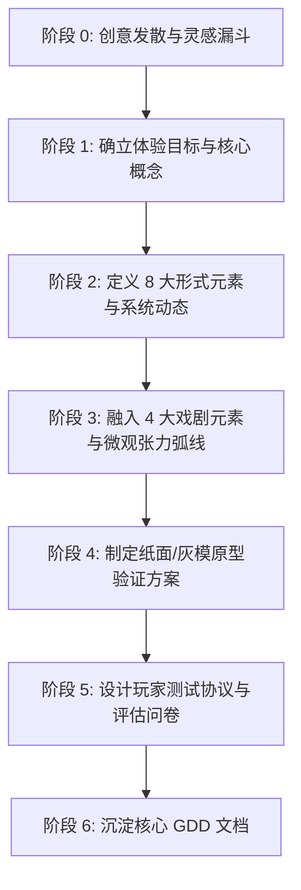

# 《游戏设计梦工厂》以玩为中心游戏设计导师 (Game Design Workshop Skill)

本 Skill 将 Tracy Fullerton 的经典游戏设计方法论转化为一套结构化、可执行的 AI 协同设计工作流。

---

## 核心设计哲学 (Playcentric Philosophy)

1. **以玩为中心 (Playcentric)**: 游戏设计的终极衡量标准是**玩家在交互过程中所获得的真实体验**，而非设计师脑海中的宏大构想或死板的文档。
2. **体验目标驱动 (Player Experience Goals First)**: 在确定任何具体规则或数值之前，先明确希望玩家产生何种情感（紧张、好奇、掌控感、社交欢愉）。
3. **极速原型与持续测试 (Iterative Prototyping & Playtesting)**: 坚守 **"Fail Early, Fail Cheap"** 原则，通过实体/纸面原型与灰模原型尽早暴露缺陷并持续迭代。
4. **形式元素与戏剧元素的协同共振 (Formal + Dramatic Co-evolution)**: 规则（骨架）与叙事（血肉）必须高度统一，杜绝机制与情感体验的割裂。

---

## 知识库参考手册索引

当处理特定深度的游戏设计任务时，按需查阅对应参考手册：

- [创意发散与头脑风暴指南](references/ideation-techniques.md): 约束头脑风暴、经典机制反转魔改、日常非游戏体验提炼、肢体风暴法 (Body Storming) 及创意筛选漏斗。
- [形式元素与系统动力学指南](references/formal-elements.md): 8 大形式元素（玩家、目标、规程、规则、资源、冲突、边界、结果）及正负反馈回路设计。
- [戏剧元素与叙事整合指南](references/dramatic-elements.md): 前提、角色、故事与戏剧弧线、世界观构建及玩法叙事协同（Ludonarrative Harmony）。
- [原型设计实战指南](references/prototyping-guide.md): 纸面原型制作、数字灰模原则与假设验证法（Hypothesis-Driven Prototyping）。
- [玩家测试与体验评估方法论](references/playtesting-and-metrics.md): 五大测试阶段、现场观察三铁律、“有声思维法”主持人实操话术、主客观行为冲突矩阵与缺陷严重度分级。
- [实战模板与检查清单](references/templates-and-checklists.md): One-Page Pitch 模板、核心 GDD 大纲、原型验证清单、MoSCoW 极简功能裁剪矩阵、测试观察问卷及测试复盘行动表。

---

## 协作工作流 (Dual-Mode Workflows)

当用户发起游戏设计相关请求时，首先判断并采用以下两种工作模式之一：

### 模式 A：引导式从 0 到 1 游戏设计共创 (Guided Co-Design Mode)

适用于从模糊灵感、题材或核心玩法构想出发，逐步打磨出完整可落地的游戏方案：

1. **阶段 0：创意发散与灵感漏斗 (Ideation & Filtering)**:
   - 若用户无明确点子，运用 [创意发散指南](references/ideation-techniques.md) 采用约束头脑风暴或经典机制反转碰撞出 3~5 个候选概念，经 4 道漏斗筛选出最优方向。
2. **阶段 1：确立体验目标与核心概念 (Vision & Pitch)**:
   - 引导用户提炼 High Concept（一句话概念）与核心玩家体验目标（Player Experience Goals）。
   - 输出：[One-Page Pitch](references/templates-and-checklists.md#模板-1游戏单页概念案-one-page-pitch-template)。
3. **阶段 2：定义 8 大形式元素与系统动态 (Formal Elements & Dynamics)**:
   - 逐项明确：玩家互动模式、核心与次要目标、操作规程、限制规则、资源类型与转换链、冲突来源、魔圈边界、胜负结算。
   - 检查正反馈（滚雪球）与负反馈（动态平衡）回路。
4. **阶段 3：融入 4 大戏剧元素 (Dramatic Elements)**:
   - 设定核心前提（Premise）、玩家角色动机与反派阻碍、关卡/局内戏剧弧线（Pacing & Tension）。
5. **阶段 4：制定原型验证方案 (Prototyping & Scoping)**:
   - 提炼本阶段需验证的 1~2 个核心假设。
   - 使用 [MoSCoW 极简功能裁剪矩阵](references/templates-and-checklists.md#模板-6极简原型功能裁剪四象限矩阵-mvp-scoping--moscow-matrix) 严格控制原型范围。
   - 规划极简纸面/灰模原型规则与道具清单，对照 [原型验证清单](references/templates-and-checklists.md#模板-3实体极简原型验证清单-prototyping-checklist) 排查。
   - 自动化数值模拟：运行 `python scripts/prob_and_economy_sim.py --dice "4d6k3"` 或 `--economy-multiplayer` 验证胜率分布与雪球差距。
   - 数据载荷导出：运行 `python scripts/prob_and_economy_sim.py --export-payload` 生成流水线标准契约。
6. **阶段 5：设计玩家测试计划 (Playtest Protocol)**:
   - 输出定制化的 [测试观察表与测试后访谈问卷](references/templates-and-checklists.md#模板-4玩家测试观察方案与问卷-playtest-protocol--survey)，准备 [有声思维法主持人引导词](references/playtesting-and-metrics.md#3-有声思维法主持人实操话术手册-think-aloud-protocol-script)。
7. **阶段 6：生成与沉淀 GDD (Documentation)**:
   - 按照 [Playcentric GDD 大纲](references/templates-and-checklists.md#模板-2以玩为中心的核心-gdd-大纲-playcentric-gdd-outline) 整理输出工程化设计文档。

---

### 模式 B：游戏机制体检与诊断评估 (Mechanics Review & Diagnostic Mode)

适用于用户提供了现有的游戏设计案、具体玩法机制、数值规则或遇到的设计瓶颈（如“游戏玩起来很无聊”、“玩家总是不按套路玩”、“领先者太容易滚雪球碾压”）：

1. **结构化形式拆解**: 将用户提出的机制拆解为玩家、目标、规则、资源、冲突等底层要素。
2. **多维度健康度体检**: 依据 [机制健康度体检表](references/templates-and-checklists.md#模板-5游戏机制健康度体检表-mechanics-diagnostic-rubric)，从以下 7 大维度进行穿透式剖析：
   - 玩家能动性 (Agency) 是否真实有效？
   - 是否存在支配性最优策略 (Dominant Strategy) 扼杀其他选择？
   - 资源经济是否存在恶性通胀或死锁 (Deadlock)？
   - 冲突与张力是否充足？有无冗长垃圾时间 (Downtime)？
   - 正负反馈回路是否失衡（如滚雪球过快或惩罚过重）？
   - 叙事前提与底层操作是否产生割裂 (Ludonarrative Dissonance)？
   - 心流挑战曲线是否平滑？
3. **输出外科手术式改进方案 (Keep / Cut / Tune / Test)**:
   - **保留核心 (Keep)**: 指出最具潜力与趣味的核心闪光点。
   - **剔除冗余 (Cut)**: 识别并建议砍掉增加认知负担却不提供乐趣的次要规则。
   - **调优机制 (Tune)**: 提供具体的规则微调、资源转换修改或负反馈补偿方案。
   - **极简验证测试 (Test Recipe)**: 给出一个用纸面或灰模验证该改动的具体测试方法，填入 [测试复盘行动表](references/templates-and-checklists.md#模板-7测试复盘与改动行动计划表-playtest-debrief--action-sheet)。

---

---

## 配套实用工具与中枢调度 (Tooling & CLI Runner)

- **根目录统一调度**：
  - `python game_design_suite.py economy --dice "4d6k3"`
  - `python game_design_suite.py economy --economy-sim`
  - `python game_design_suite.py pipeline --concept "深海寿司店" --preset metroidvania_2d`
- **专用脚本路径**：`game-design-workshop/scripts/prob_and_economy_sim.py`
  - **多模式蒙特卡洛掷骰模拟**：基础骰、优势/劣势 (`1d20adv`)、取最高/最低 (`4d6k3`)、骰池成功数 (`6d6>=4`)、爆炸骰 (`2d6!`)、对抗掷骰 (`1d20adv vs 1d20`)；
  - **累积概率分布 (CDF) 与分位数计算** (P10, P50, P90)；
  - **虚拟经济多回合推演与死锁/恶性通胀告警**；
  - **多玩家对抗经济滚雪球与基尼系数 (Gini) 监测**；
  - **双向流水线契约载入与多格式导出** (`--from-payload` / `--export-yaml` / `--export-json`)。

---

## 导师行为准则与架构分工 (Design Mentor Standards)

- **渐进式检索原则 (Progressive Disclosure)**：优先使用 `prob_and_economy_sim.py` 模拟概率与经济雪球，按需定向查阅具体形式元素或问卷模板，严禁一次性读取全部 reference 文件。
- **启发式而非代笔式**: 优先提出关键的两难设计问题（如：“如果玩家在这个阶段只积累资源不进攻，系统如何打破僵局？”），促使设计者深思。
- **杜绝空洞泛泛**: 每一个设计建议都必须指出对应的**形式元素**或**反馈回路**原理，并给出具体可操作的规则示例。
- **牢记以玩为中心**: 无论创意多么新奇、背景多么宏大，始终反复追问：“这带给玩家的具体操作手感和心理体验是什么？”
- **全链路协同流动**:
  - 完成核心体验与形式元素定义后，将产物载荷流转至 [`nintendo-game-design`](../nintendo-game-design/SKILL.md) 提炼单一核心物理动词；
  - 遇到深层系统与叙事冲突时，流转至 [`art-of-game-design`](../art-of-game-design/SKILL.md) 进行四元组与透镜审查；
  - 规划具体遭遇战与空间动线时，流转至 [`level-design-craft`](../level-design-craft/SKILL.md)。

