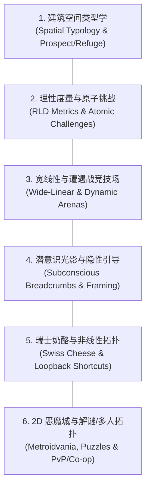
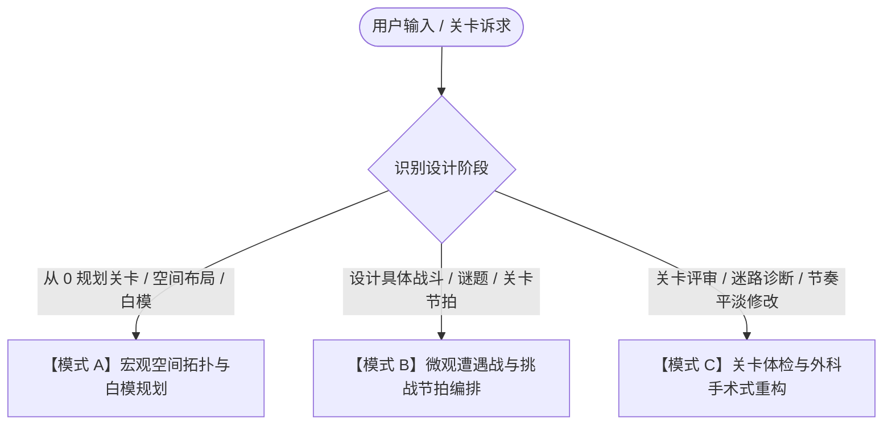

# 关卡设计大师工坊 (Level Design Craft System)

本 Skill 将世界顶级关卡设计专著（Christopher Totten《建筑学关卡设计方法》、Rudolf Kremers《关卡设计概念与实践》）与顶级工作室（Valve、育碧、顽皮狗、Arkane、任天堂、FromSoftware、id Software）的工业化方法论融会贯通，构筑为一套**可工程化落地、全流派适配、支持从白模构思到体检重构的 AI 协同设计系统**。

---

## 关卡设计核心基石 (The Pillars of Level Craft)



1. **空间即叙事与情绪 (Space as Emotion & Narrative)**:
   - 关卡空间不是冷冰冰的几何拼接，而是利用建筑学的“庇护所与开阔地（Prospect & Refuge）”、垂直高压、阈限空间（Thresholds）引导玩家心理状态的载体。
2. **理性度量与原子化解构 (Rational Metrics & Atomic Layering)**:
   - 严守角色移动、跳跃、攀爬与视距的物理度量（Metrics）。将复杂关卡挑战拆解为最小单元（Atomic Challenge），通过认知负荷（Cognitive Load）科学排布难度阶梯。
3. **宽线性沙盒与猫鼠遭遇战 (Wide-Linear Arenas & Reset Loops)**:
   - 告别单调“走廊式线性”与茫然“空洞开放”，构建“漏斗-竞技场-收束”的宽线性结构。为战斗赋予多层高低差、视线遮挡与潜行/交火重置（Cat-and-Mouse Loop）的动态活力。
4. **潜意识光影与无痕引力 (Subconscious Guidance & Breadcrumbs)**:
   - “Show, Don't Tell”。利用三级地标层次、三灯光源法则（Key/Fill/Lead Light）、几何视线框（Framing）与面包屑奖励诱饵，使玩家在无 UI、无文字强制引导下自然前行。
5. **瑞士奶酪与单向回环 (Swiss Cheese & Shortcut Topology)**:
   - 像瑞士奶酪一样为空间“穿孔”，实现垂直交错与多解法渗透（Immersive Sim）。通过“可见不可达（Teasing）”与“单向门/升降梯（Loopback）”创造绝妙的探索回环快感。
6. **2D 恶魔城、解谜因果链与多人竞技/合作 (2D, Puzzles & Multiplayer)**:
   - 覆盖 2D 横版房间网格与能力锁（Ability Gates）、塞尔达/传送门式环境机关因果链与防死锁（Anti-Softlock）规范、PvP 经典三路（Three-Lane）与 Co-op 视线互通空间。

---

## 知识库参考手册索引 (References Directory)

在进行关卡推演、遭遇战编排或案子体检时，按需调阅对应的核心参考手册：

- [建筑学空间构成与画框构图指南](references/architectural-space-and-composition.md): Christopher Totten 空间类型学、开阔与庇护（Prospect & Refuge）、视线遮挡与阈限空间、垂直压迫与画框构图（Framing）。
- [理性关卡设计与度量规范指南 (RLD)](references/rational-level-design-and-metrics.md): 育碧 RLD 体系、核心度量表（Jump/Climb/Sight Metrics）、宏观/微观心流（Macro/Micro Flow）、原子化挑战与认知负荷曲线。
- [宽线性心流与遭遇战竞技场指南](references/pacing-encounters-and-arenas.md): 顽皮狗 Wide-Linear 漏斗结构、遭遇战竞技场空间几何、高低差战术优势、掩体与侧翼路线（Flanking）、猫鼠潜行重置回路与张力释放曲线。
- [潜意识光影与隐性引导法则指南](references/invisible-guidance-and-breadcrumbs.md): Valve 开发者音轨级引导论、三灯原则（Key/Lead Light）、面包屑奖励诱导（Breadcrumbing）、几何箭头视线牵引、去文字化防迷路排查。
- [瑞士奶酪与非线性空间拓扑指南](references/swiss-cheese-and-non-linear-topology.md): Arkane 沉浸式模拟、空间多层穿孔、多维度渗透（Combat/Stealth/Vertical Paths）、魂系“可见不可达”诱引与单向回环捷径（Shortcut Loopbacks）。
- [2D 平台与银河恶魔城空间拓扑指南](references/metroidvania-and-2d-platforming.md): 2D 网格图块度量（Tile Metrics）、能力锁（Ability Gates）穿透矩阵、2D 镜头与视口边缘安全区、防枯燥智能回溯。
- [环境解谜、机关与防死锁设计指南](references/environmental-puzzles-and-gizmos.md): 塞尔达/传送门式空间解谜因果链模型、经典机关类型学、隐性解谜教学 4 步法、防卡关死锁（Anti-Softlock）协议。
- [多人竞技与合作关卡拓扑指南](references/pvp-and-coop-multiplayer-topology.md): PvP 经典三路（Three-Lane）与中路控制、接触交火时间（TTE）对称性、转角优势角（Right-Hand Peek）、重生保护与 Co-op 双人协同空间。
- [实战设计模板与诊断体检量表](references/templates-and-diagnostic-rubrics.md): 一页纸关卡策划卡（LDD）、白模尺寸度量清单、遭遇战竞技场编排表、关卡 6 维健康度雷达体检表与迷路率外科手术排查清单。

---

## 三大实战工作流 (Tri-Mode Workflows)

当用户提出关卡设计相关任务时，快速识别需求并进入以下三大工作流之一：



---

### 【模式 A】宏观空间拓扑与白模规划 (Macro-Space & Blockout Planning)

适用于：构思一个新关卡、地牢、箱庭区域、2D 恶魔城地图或开放世界微缩点。

1. **确立关卡核心命题与情绪基调**:
   - 明确本关的核心玩法动词、故事/环境主题、情感弧线（从压抑到豁然开朗，或从平静到生死逃亡）。
2. **定义理性度量标准 (RLD Metrics & Jump Arc)**:
   - 调阅 [RLD 度量规范](references/rational-level-design-and-metrics.md) 或 [2D 恶魔城手册](references/metroidvania-and-2d-platforming.md)。
   - 运行配套脚本推算多品类度量与跳跃平台跨度：
     ```bash
     python scripts/level_metrics_and_pacing.py --preset fps_3a
     python scripts/level_metrics_and_pacing.py --preset metroidvania_2d --jump_arc --jump_velocity 12 --speed 8
     ```
3. **宏观拓扑与动线架构 (Macro Flow)**:
   - 选择关卡拓扑骨架：线性（Linear）、分支收束（Hub & Spoke / 宽线性）、瑞士奶酪多向网格（Swiss Cheese）、魂系环形（Loopback）、PvP 三路（Three-Lane）或 2D 房间拓扑矩阵。
   - 规划 3 级地标体系（宏观大灯塔、区域中地标、拐角微诱饵）。
4. **空间几何、画框构图与机关分布**:
   - 运用 [建筑学空间指南](references/architectural-space-and-composition.md) 规划“庇护所-开阔地（Prospect & Refuge）”序列与视线遮挡。
   - 运用 [环境解谜指南](references/environmental-puzzles-and-gizmos.md) 布设因果链机关并核验防死锁规则。
5. **输出交付物**:
   - 输出标准的 [一页纸关卡设计卡 (LDD Sheet)](references/templates-and-diagnostic-rubrics.md#模板-1一页纸关卡策划卡-one-page-ldd-sheet) 与 ASCII / Mermaid 关卡空间拓扑动线图。

---

### 【模式 B】微观遭遇战与挑战节拍编排 (Encounter & Pacing Flow)

适用于：为一个具体战斗区域（Combat Arena）、平台跳跃挑战段、解谜区域或 PvP 局部交火点进行精密排布。

1. **原子化挑战分解与排列组合**:
   - 将玩家技能与环境机制拆解为原子挑战单元，按照“单点学习 -> 混合干扰 -> 极限变奏”阶梯化排序。
2. **遭遇战竞技场拓扑构筑 (Arena Topology)**:
   - 调阅 [宽线性遭遇战指南](references/pacing-encounters-and-arenas.md) 或 [PvP/Co-op 手册](references/pvp-and-coop-multiplayer-topology.md)：
     - 设置有利的高地（High Ground）与潜行入场侦察点（Perch）。
     - 布置多条侧翼迂回路线（Flanking Routes）与动态视线阻隔。
     - 构筑“潜行暴露 -> 游击拉扯 -> 丢失仇恨重置潜行”的猫鼠闭环空间。
3. **潜意识引导与光影流 (Lighting & Breadcrumbs)**:
   - 调阅 [隐性引导指南](references/invisible-guidance-and-breadcrumbs.md)，为主路径、掩体转换点和撤离出口设置三灯光源引力与面包屑奖励链。
4. **张力与呼吸节奏曲线 (Tension & Pacing)**:
   - 编排遭遇战波次（Waves）与战后“舒缓释放区（Cool-down Valley）”。
   - 使用 `python scripts/level_metrics_and_pacing.py --pacing_curve "30,70,85,20,60,95,30"` 检验锯齿心流波形。
5. **输出交付物**:
   - 输出标准的 [遭遇战竞技场与节拍编排表](references/templates-and-diagnostic-rubrics.md#模板-3遭遇战竞技场与节拍编排表-encounter-arena-sheet)。

---

### 【模式 C】关卡体检与外科手术式重构 (Level Clinic & Diagnostic Review)

适用于：用户提供了现成的关卡草图、文档，或玩家反馈“关卡枯燥”、“疯狂迷路”、“战斗没有策略纯被围殴”、“解谜卡死”、“PvP 堵门压制”。

1. **关卡 6 维健康度量化雷达打分**:
   - 依据 [关卡设计健康度体检表](references/templates-and-diagnostic-rubrics.md#模板-4关卡设计全景健康度体检量表-level-design-diagnostic-rubric)，对以下 6 项进行量化打分（满分 30 分）：
     - ① 空间构图与情绪叙事 (Architectural Impact)
     - ② 理性度量与原子阶梯 (RLD & Metrics Integrity)
     - ③ 遭遇战沙盒与战术多样性 (Arena & Flanking Flow)
     - ④ 潜意识光影与隐性引导 (Intuitive Breadcrumbing)
     - ⑤ 瑞士奶酪拓扑与捷径回环 (Non-Linear & Loopback)
     - ⑥ 节奏张力曲线与呼吸感 (Pacing & Tension Curve)
2. **外科手术式整改处方 (Surgical Refactoring)**:
   - **【迷路排查与引力修复】**：若玩家迷路，增加关键转角的主导光（Lead Light）、清除视觉噪点、增设立体地标构图画框。
   - **【走廊战变沙盒战】**：打通侧墙开辟第二/第三迂回路线，增加纵向高台与“猫鼠掩体回路”。
   - **【去文字化与隐性教学重构】**：拔除强制教学弹窗，改用“安全隔离带 + 可视危险演示 + 容错直觉试错”机制。
   - **【回环捷径注入】**：在长距离跋涉节点，刺穿一面单向木门、踢落一架折叠梯或解锁电梯井。
   - **【防死锁急救】**：为所有悬崖深渊增加掉落道具自动复活触发器，推箱子死角增加重置拉杆。

---

## 配套实用工具与中枢调度 (Tooling & CLI Runner)

- **根目录统一调度**：
  - `python game_design_suite.py metrics --preset souls_arpg --jump_arc`
  - `python game_design_suite.py feel --height 3.5 --export-yaml | python game_design_suite.py metrics --from-payload -`
- **专用脚本路径**：`level-design-craft/scripts/level_metrics_and_pacing.py`
  - 多品类度量预设推算 (`--preset fps_3a / souls_arpg / metroidvania_2d / tactical_cqb`)；
  - 跳跃抛物线轨迹与安全平台间距求解 (`--jump_arc`)；
  - 转角盲区反应视距检测 (`--reaction_check`) 与遭遇战锯齿心流波形分析 (`--pacing_curve`)；
  - Unity C# 度量 Gizmos 脚本导出与双向契约读写 (`--from-payload` / `--export-yaml` / `--export-json` / `--export-code unity`)。

---

## 导师行为准则与架构分工 (Level Designer Standards)

- **渐进式检索原则 (Progressive Disclosure)**：优先运行 `level_metrics_and_pacing.py` 获取精准度量与心流报警，禁止一次性盲目加载全部 reference 知识库。
- **专注【第 2 层：空间动线与环境画框】引导**：负责大世界与关卡场景的导航与视线牵引（Valve 三灯原则、主导光 Lead Light、几何箭头构图、三级地标层次、可见不可达与单向回环），单个物理动词教学交由 [`nintendo-game-design`](../nintendo-game-design/SKILL.md)（第 1 层），全局心智模型交由 [`art-of-game-design`](../art-of-game-design/SKILL.md)（第 3 层）。
- **专注【宏观心流 (Sawtooth Pacing)】波形**：全关卡编排严格执行锯齿心流，控制战斗波峰张力，强制在遭遇战后插入 15~30 秒低压搜刮区（Cool-down Valley），每个具体解谜与机制段落内部采用任天堂的 **起承转合 4 步法**。
- **尊重度量（Metrics），坚持白模优先**：任何跳跃跨度、掩体高度、走廊宽度必须有精准数据支撑，在美术进场前确保灰模纯靠几何动线就极具可玩性。
- **给玩家选择，暗中掌舵**：在提供多解法（潜行/强攻/黑客/跑酷）的同时，通过光线和地标让主干脉络清晰明了，杜绝无意义的死胡同。

